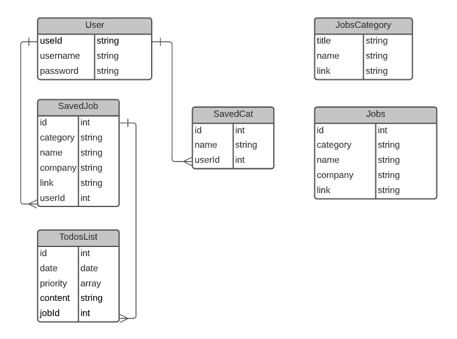
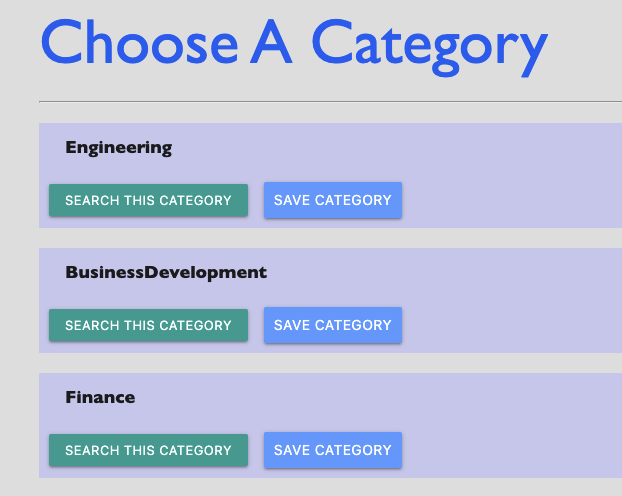
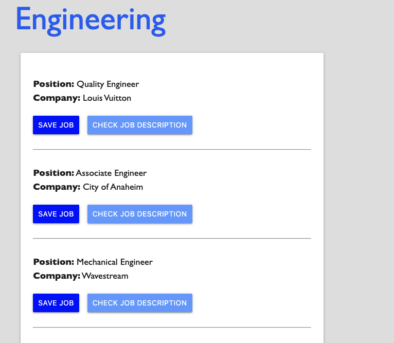
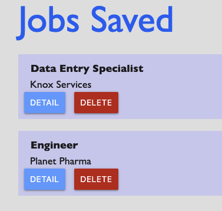
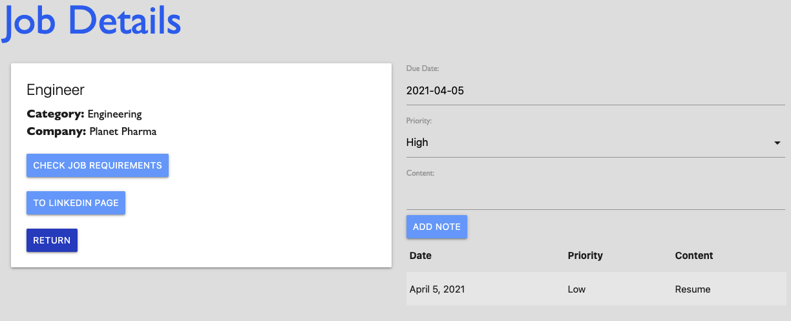

  # JobOrg

    This App is to help user organize jobs found on LinkedIn with ease.
    The user can save the job into a list to track later.
    User can also add notes inside of a save job as reminders such as resume or interview dues.

  # Database Setup
  

    Users have access to all models, and save the jobs and categories into the SAVED type models.
    The Jobs and JobsCategory models will be reset every time a query is run, 
    since the availablities of jobs on LinkedIn changes over time, 
    it won't be helpful to keep jobs that are no longer available in database.

  
  ### Pages Accessible To Logged In Users
  

  ### Choose Category For Available Jobs
  
  
  ### Save Category To Saved Categories List
  

  ### Search Results From Selected Category
  

  ### Save Job To Saved Jobs List
  

  ### Detail Page For Job
  
  

  # Functions
  ## Find Jobs
    The Find Jobs tab will take user to a page that displays the categories grabbed from LinkedIn page with Selenium,
    users will be able to choose one of the categories displayed to search the available jobs on LinkedIn.

  ## Save Category
    This enables user to save the category to a list, 
    and can be use to search without scraping all available categories on LinkedIn, 
    saving the extra step and loading time.

  ## Save Job
    User can save a job to the Saved Jobs list, there user will be able to check the details of the job as well as add notes as reminders.

  ## Note
    The Note feature in the job details page include three fields, date, priority, and content.
    Users can use it to save information such as resume or interview due dates of the job.
